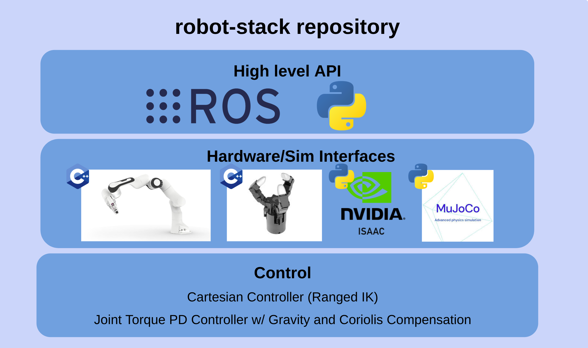
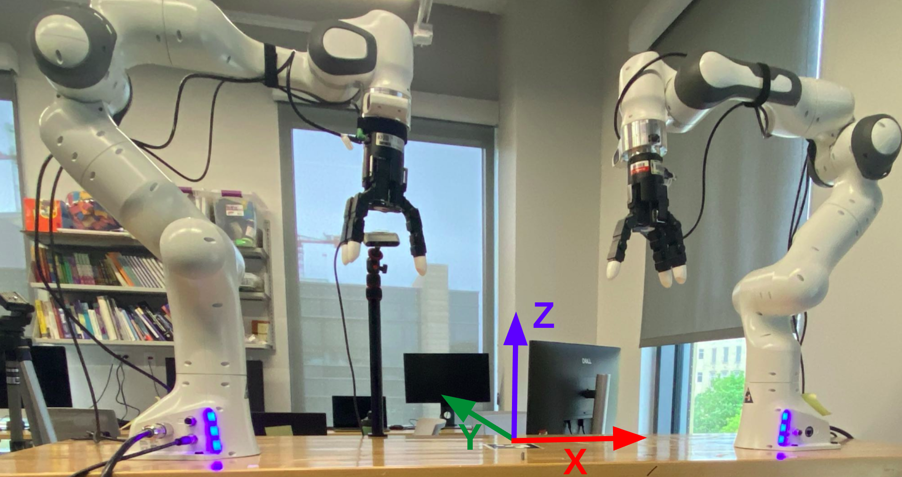

# Robot Stack

This codebase currently is setup to support controlling the Bimanual Franka Emika Panda system in both sim and real. It has a high-level Python and ROS API.



Note, [robot_tutorials](https://github.com/Wisc-HCI/robot_tutorials/) contains a great example for how to use the python interface for this repo.

## Hardware Requirements

**Computers:**
This requires at least one computer. Depending on what you want to do, you'll need one of the following...
* `COMPUTER 1` To run the robot hardware: Ubuntu computer (20.04, 22.04 or 24.04 recommended) setup with the [Panda FCI](https://frankarobotics.github.io/docs/libfranka/docs/getting_started.html) and [Realtime Kernel Patch Kernel Patch](https://frankarobotics.github.io/docs/libfranka/docs/real_time_kernel.html). This is for running the robot controllers. This real-time kernel patch breaks Nvidia drivers.
* `COMPUTER 2` To run Isaacsim: Ubuntu computer (22.04 or 24.04 recommended) with a Nvidia GPU (GeForce RTX 40 Series recommended, preferably >= 4070). This is for running Isaacsim and the interface. 
* `COMPUTER 3` To run Mujoco Simulation (no ROS support currently): Any Ubuntu computer

**Robots**
* 2 Franka Emika Panda 7 DOF Robots.
    * Robot system version: 4.2.X (FER pandas)
    * Robot / Gripper Server version: 5 / 3
* 2 [Tesollo Dg-3F](https://en.tesollo.com/dg-3f-b/) Grippers. 1 mounted on each Panda and set to external mode with the switches.

**Please configure your hardware and network according to [these instructions](https://github.com/Wisc-HCI/robot_tutorials/blob/main/instructions/bimanual_system_setup.md).**


## Software Requirements
It is greatly recommended you run everything through our Docker Containers. To do this, you will need, you will need Docker Desktop or Docker Engine+Compose. Below are the instructions for each operating system:
* [Mac Instructions](https://docs.docker.com/desktop/setup/install/mac-install/)
* [Windows Instructions](https://docs.docker.com/desktop/setup/install/windows-install/)
* Ubuntu Instructions: First, install [Docker Engine](https://docs.docker.com/engine/install/ubuntu/#install-using-the-repository) (recommend using apt). Then [configure docker as a non-root user](https://docs.docker.com/engine/install/linux-postinstall/#manage-docker-as-a-non-root-user). Finally, install [Docker Compose](https://docs.docker.com/compose/install/linux/#install-using-the-repository).


If you do not want to use docker (not recommended), you can instead look at the README in each subdirectory (robot_description, robot_motion, robot_motion_interface), and follow the instructions to install everything from source.


## Setup
There are several docker containers provided depending on what computer you are running on and what you are trying to run. Choose one of the following containers to build and run...

 
a. On COMPUTER 1/3 (Docker with just ROS and workspace dependencies):

```bash
xhost +local: # Note: This isn't very secure but is th easiest way to do this
docker compose -f docker/compose.ros.yaml build
docker compose -f docker/compose.ros.yaml run --rm ros-base 
```

NOTE: if you need to start another terminal, once the container is started, run `docker compose -f docker/compose.ros.yaml exec ros-base bash`. 


b. On COMPUTER 2 (Docker with nvidia ROS and workspace dependencies):

```bash
xhost +local: # Note: This isn't very secure but is th easiest way to do this
docker compose -f docker/compose.ros.gpu.yaml build
docker compose -f docker/compose.ros.gpu.yaml run --rm ros-gpu
```

NOTE: if you need to start another terminal, once the container is started, run `docker compose -f docker/compose.ros.gpu.yaml exec ros-gpu bash`. 


c. On COMPUTER 2 (Docker with Isaacsim, ROS, and workplace dependencies):

```bash
xhost +local: # Note: This isn't very secure but is th easiest way to do this
docker compose -f docker/compose.isaac.yaml build
docker compose -f docker/compose.isaac.yaml run --rm isaac-base 
```

To test that isaacsim is working correctly, you can run `isaacsim`.

NOTE: If you need to start another terminal, once the container is started, run `docker compose -f docker/compose.isaac.yaml exec isaac-base bash`

d. On COMPUTER 2/3 mujoco (and workspace dependencies). This takes ~6 minutes to install and requires 6GB of space.
```bash
xhost +local: # Note: This isn't very secure but is th easiest way to do this
docker compose -f docker/compose.mujoco.yaml build
docker compose -f docker/compose.mujoco.yaml run --rm mujoco-base
```

Run `python -m mujoco.viewer` to test everything is setup (empty mujoco window will appear).

NOTE: if you need to start another terminal, once the container is started, run `docker compose -f docker/compose.ros.yaml exec mujoco-base bash` 


## Running Python Examples
This is an example that makes the robot "dance". Run one of the following depending on your computer/container setup:
```bash
# Docker a: Run on real hardware
python3 -m  robot_motion_interface.examples.oscillating_ex --interface hardware

# Docker c: Run in isaacsim
python3 -m  robot_motion_interface.examples.oscillating_ex --interface isaacsim

# Docker d: Run on mujoco (display forwarding)
python3 -m  robot_motion_interface.examples.oscillating_ex --interface mujoco

# Docker d: Run on mujoco (in browser)
python3 -m  robot_motion_interface.examples.oscillating_ex --interface mujoco_browser

```

These are some additional isaacsim examples:
```bash
# Docker c: Make objects appear
python3 -m  robot_motion_interface.examples.isaacsim_objects
```

## Running ROS Examples
1. Build  ROS packages
    ```bash
    colcon build --cmake-clean-cache --symlink-install --base-paths robot_motion_interface/ros
    source robot_motion_interface/ros/install/setup.bash
    ```
2. Launch one of these 2 depending on your docker container:
    ```bash
    # Docker a: Launch bimanual arms
    ros2 run robot_motion_interface_ros interface --ros-args -p interface_type:=bimanual -p config_path:=/workspace/robot_motion_interface/config/bimanual_arm_config.yaml

    # Docker c: Launch Isaacsim
    ros2 run robot_motion_interface_ros interface --ros-args -p interface_type:=isaacsim -p config_path:=/workspace/robot_motion_interface/config/isaacsim_config.yaml

    # Docker c: Launch Isaacsim with object interface
    ros2 run robot_motion_interface_ros interface --ros-args -p interface_type:=isaacsim_object -p config_path:=/workspace/robot_motion_interface/config/isaacsim_config.yaml
    ```
3. Now, try publishing to these topics:
    ```bash

    # Home robot
    ros2 topic pub --once /home std_msgs/msg/Empty "{}" 

    # Publish cartesian position to left panda
    ros2 topic pub /set_cartesian_pose geometry_msgs/PoseStamped "{ header: {frame_id: 'left_delto_offset_link'}, pose: {position: {x: -0.2, y: 0.2, z: 1.2}, orientation: {x: 0.707, y: 0.707, z: 0.0, w: 0.0} }}" --once

    # Publish cartesian position to right panda
    ros2 topic pub /set_cartesian_pose geometry_msgs/PoseStamped "{ header: {frame_id: 'right_delto_offset_link'}, pose: {position: {x: 0.2, y: 0.2, z: 1.2}, orientation: {x: 0.707, y: 0.707, z: 0.0, w: 0.0} }}" --once

    # Publish 12 joints to Tesollo
    ros2 topic pub /set_joint_state sensor_msgs/msg/JointState '{ name: ["left_F1M1", "left_F1M2", "left_F1M3", "left_F1M4", "left_F2M1", "left_F2M2", "left_F2M3", "left_F2M4", "left_F3M1", "left_F3M2", "left_F3M3", "left_F3M4", ], position: [0.1, 0.1, 0.1, 0.1, 0.1, 0.1, 0.1, 0.1, 0.1, 0.1, 0.1, 0.1]}' --once

    # Partial Left Tesollo update
    ros2 topic pub /set_joint_state sensor_msgs/msg/JointState '{ name: ["left_F1M1"], position: [-0.1]}' --once
    ```


## More examples
There are more examples in each of the sub-directory README's (ROS actions, etc.).


## Notes
* The robot coordinate system is x is right, y is forward, and z is up (x,y,z). (0,0,0) is at the floor, centered in the middle of the table. The table top center is at about (0, 0, 0.95).

    